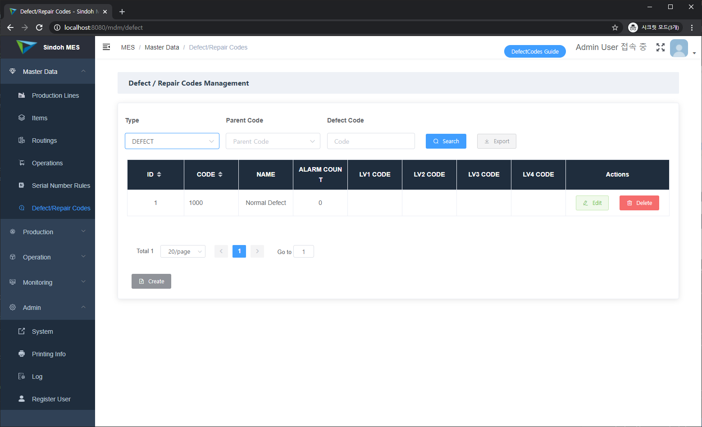

[Eng](manual_mdm.md) / 한글

## 1. Lines

### 1) Site Management

라인 관리에 앞서서 뺴 놓을 수 없는 것으로는 생산 거점 관리가 있습니다.

이 버전에서는 생산 거점 관리 부분이 빠져 있고, 다음 버전에서 구현할 예정입니다. 하지만 생산 거점 자체가 무시된 것은 아니고, 한 개의 거점에서 모든 라인 및 생산을 담당하는 것을 전제로 하였습니다. 

생산 거점과 관련된 부분은 PostgreSQL에 연동된 DB에 해당 정보가 있으며, 이는 다음과 같습니다.

```SQL
select * from mes_sites;
```


생산 거점 정보는 DB Table의 값을 Update하는 형태로 변경 가능하나, id는 반드시 1을 유지해 주셔야 하며, 추후 생산 거점 관리 기능 구현 시 더욱 체계적으로 관리할 수 있도록 하겠습니다.

### 2) Line Management

라인 관리는 생산의 기본적인 단위를 뜻합니다. 쉽게 이해하면 생산 조립 라인을 뜻하는 것으로, 라인이 설정되어 있어야 작업 오더(Job Order)를 생성할 수 있고 관리할 수 있습니다.

생산 거점 관리 기능이 별도 구현되지 않는 한, 생산의 가장 기본적인 단위는 생산 라인이 되므로 이에 대한 관리는 필수로 이루어져야 합니다.


## 2. Items

품목(Item)은 생산에서 사용하는 모든 품목을 나타냅니다. 제품이 될 수도 있고, 부품이 될 수도 있고, 원재료 및 중간 생산품 등이 될 수도 있습니다. 

품목 정보는 크게 다음과 같이 구분되며, 품목 관리 화면은 다음과 같이 구성되어 있습니다.

+ 품목 정보
+ 품목 별 일련번호(Serial) 정보
+ 품목 별 포장(Packing) 정보
+ 품목 별 출력물(Printout) 정보


품목 별 일련번호와 관련해서는 일련번호 관리 화면에서 관리 중인 일련번호를 선택하는 방식으로 이루어졌으며, 반대로 포장 정보 및 출력물 정보는 품목 관리 화면 내부에서 직접 입력 및 관리해야 합니다.

## 3. Operations

공정(Operation)은 제조 라인에서 생산을 수행할 때 어떤 것을 수행하는 지를 나타내는 부분입니다. 이 버전에서는 공정을 시작, 부품 투입, 완성, 검사, 포장 공정을 수행할 수 있도록 하였으며, 등록 공정 역시 이에 맞추어서 입력해야 합니다.


공정명과 관련된 정보는 Vue.js 소스코드의 parameter.js 파일에 등록된 값을 따릅니다. 이 값은 자유자재로 변경할 수 있으나, 등록된 값으로 공정을 생성 및 관리해야 정상적인 공정 입력이 가능하므로 유의 바랍니다.

parameter.js

```
module.exports = {
  ...
  op_sol: 'ST',
  op_trace: 'TRC',
  op_eol: 'COM',
  op_packing: 'PK',
  op_inspection: 'IN',
  ...
}
```

공정 중 부품 투입 공정의 경우에는 실제 투입될 부품에 대한 정보를 입력할 수 있습니다. 


## 4. Routings

라우팅은 품목 별 공정정보를 등록 및 관리하는 화면으로, 품목 및 공정정보가 사전에 등록이 되어 있어야만 입력이 가능합니다.


좌측 정보는 검색한 품목의 라우팅을 나타냅니다. 품목 검색을 해야만 반드시 조회가 가능하며, 품목 별 라우팅이 없을 경우에는 신규로 생성 후 세부 정보를 입력할 수 있도록 합니다.

우측 정보는 라우팅 등록을 위한 공정 정보를 나타냅니다. 검색된 공정을 바탕으로 해서 좌/우측으로 넘기는 형태로 입력이 가능합니다. 


## 5. Serial Numbers

대부분의 제품은 일련번호를 가집니다. 이와 관련하여 일련번호를 매기는 방식은 품목에 따라 결정되거나, 아니면 특정 그룹 내에서 결정되기도 합니다. 그렇기 때문에 일련번호 관리는 반드시 품목에 의존적이지는 않고, 별도의 규칙을 생성하여 관리하도록 되어 있습니다.

일련번호 규칙을 일반적으로 날짜 포맷(Y/M/D) 등의 정보를 따르며, 다양한 유형의 날짜 정보를 규칙으로 할 수도 있습니다. 일련번호 관리화면은 이러한 규칙을 설정하는 용도로 사용됩니다.


## 6. Defect/Repair Codes

불량이 발생하면 불량 발생 원인을 파악해야 하고, 수리하게 되면 어떻게 수리했는가를 파악해야 합니다. 불량/수리 코드는 이러한 불량과 수리 코드를 입력 및 관리하기 위한 화면입니다.



불량 코드 및 수리 코드는 총 5단계 레벨로 구분되어 있습니다. 불량 및 수리 유형은 단일화된 유형이 아니라 세부 유형 및 속성을 가지기 때문에 레벨 별로 관리되어야 하기 때문입니다. 실제 사용하시면서 궁금하거나 개선 사항이 필요하다면 언제든지 피드백 부탁드리겠습니다.

<div style="text-align:right">
    <p><a href='./manual_system_mgmt.ko-KR.md'>→ System Management</a></p>
    <p><a href='./manual_production_mgmt.ko-KR.md'>→ Production Management</a></p>
    <p><a href='./manual_operation_exec.ko-KR.md'>→ Operation Execution and Monitoring</a></p>
</div>